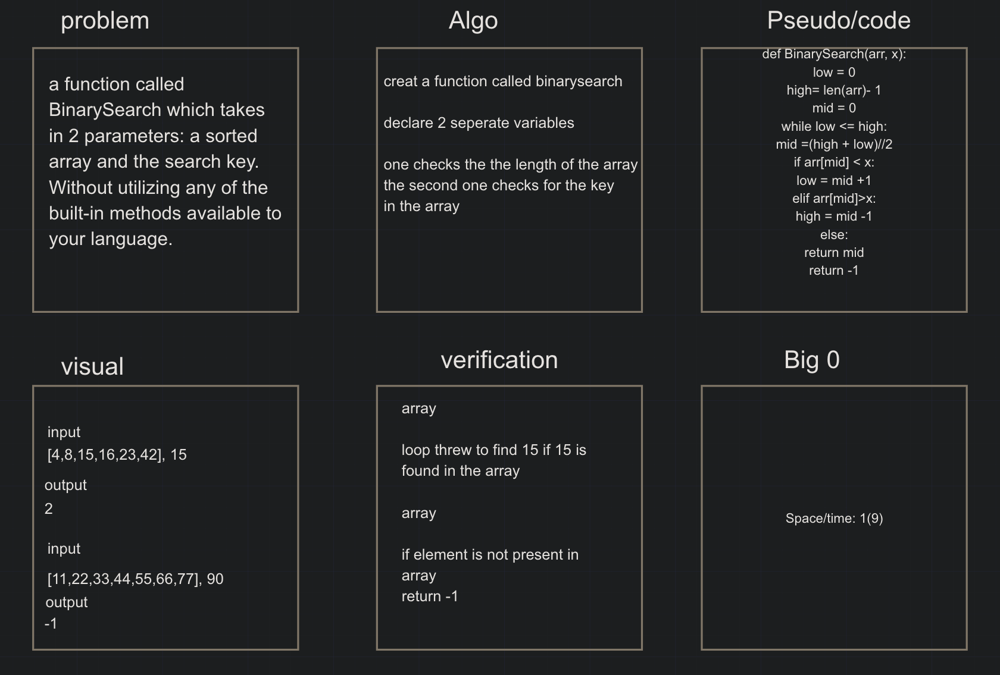
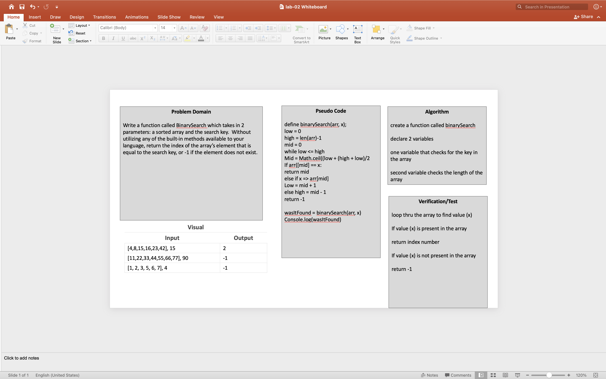

# Array Binary Search

# Binary Search
Write a function which takes in 2 parameters: a sorted array and the search key. Without utilizing any of the built-in methods available to your language, return the index of the array’s element that is equal to the search key, or -1 if the element does not exist.

## Challenge
to search a array and find a search key 

## Approach & Efficiency
was to divide the array and search for the key till we find the key we are looking for

## Solution

## Code challenge partner white board
