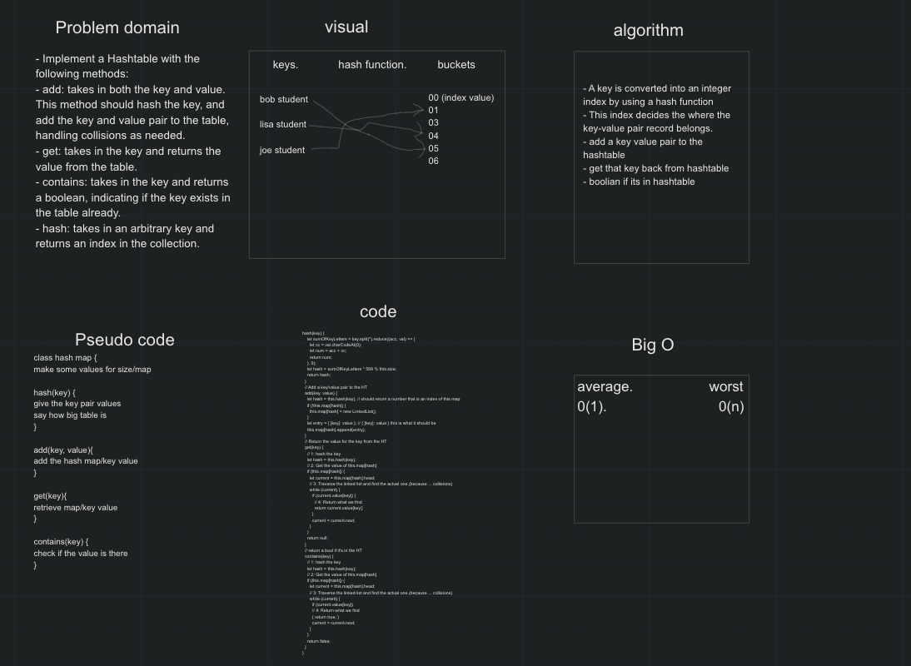

# Hashtables

- Hashtables are the most common data structure they are implemented in all programming languages
- it is used to convert key pairs to values

## Challenge

- Implement a Hashtable with the following methods:

- add: takes in both the key and value. This method should hash the key, and add the key and value pair to the table, handling collisions as needed.
- get: takes in the key and returns the value from the table.
- contains: takes in the key and returns a boolean, indicating if the key exists in the table already.
- hash: takes in an arbitrary key and returns an index in the collection.

## Approach & Efficiency

- A key is converted into an integer index by using a hash function
- This index decides the where the key-value pair record belongs.
- add a key value pair to the hashtable
- get that key back from hashtable
- boolian if its in hashtable

## UML

## refrences

- https://medium.com/@yanganif/javascript-hash-table-8878afceecbc
- https://www.educative.io/blog/data-strucutres-hash-table-javascript
- https://codeburst.io/objects-and-hash-tables-in-javascript-a472ad1940d9
