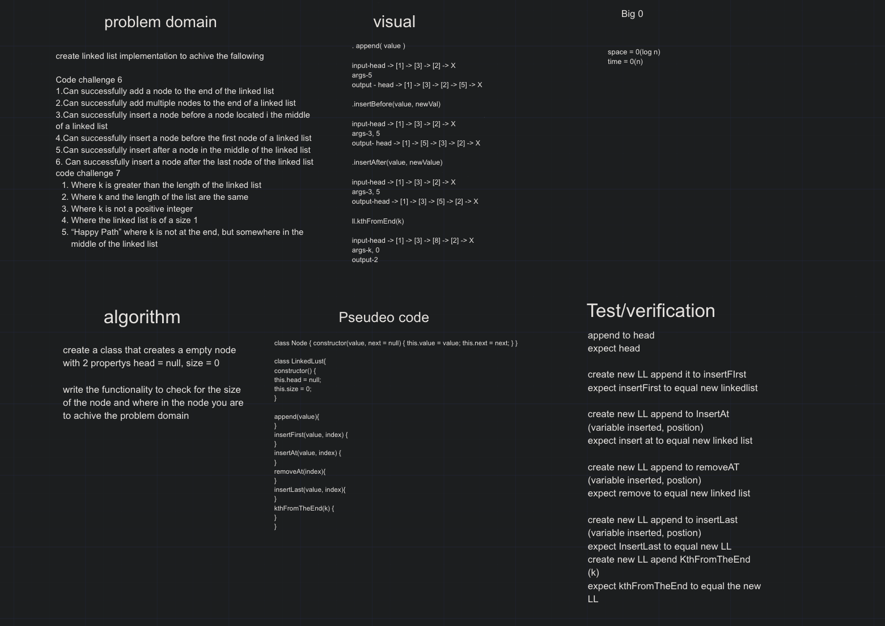
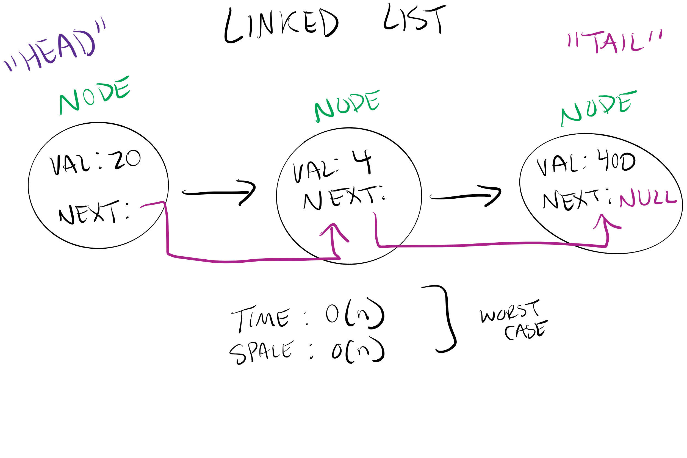
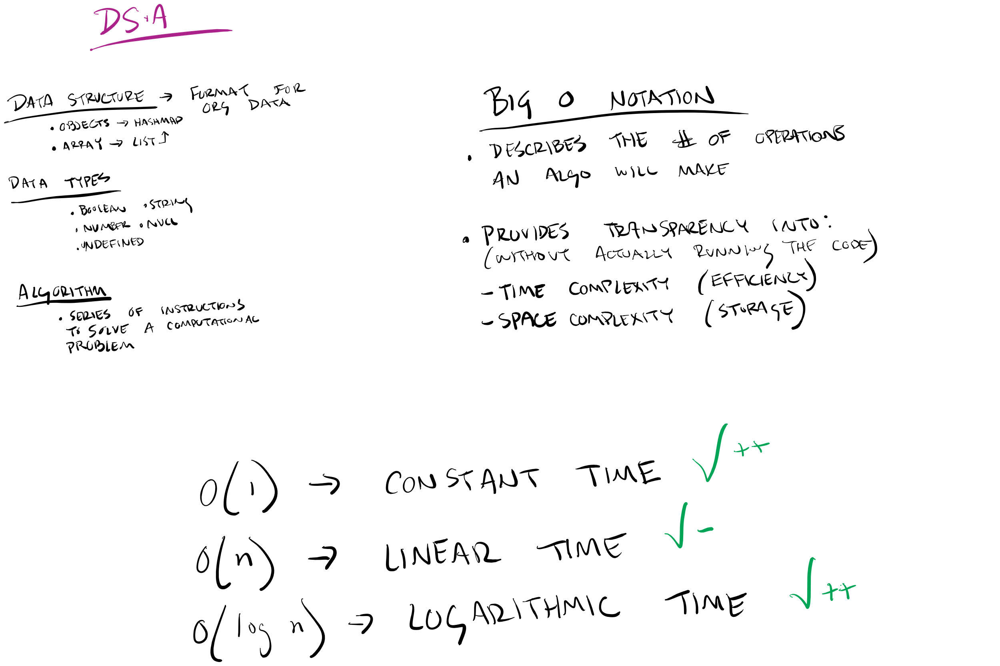

# Linked List

## Challenge

Create a Node class that has properties for the value stored in the Node, and a pointer to the next Node.

## Approach & Efficiency

create a class that scycles threw a list and gives the next value to the next line of code

## Solution

* [kth-FromTheEnd whiteboard](https://docs.google.com/spreadsheets/d/1niE7f04qm9GbqoQ85cVenSUxwJz38DfTm0PLPHLNFMY/edit?usp=sharing)

