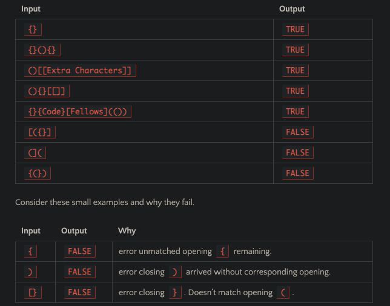

# Multi-Bracket-Validation

## Challenge

- On your main file, create…
- JavaScript: a function called multiBracketValidation(input)

### 3 types of brackets:

1. Round Brackets : ()
2. Square Brackets : []
3. Curly Brackets : {}

## Approach & Efficiency

Your function should take a string as its only argument, and should return a boolean representing whether or not the brackets in the string are balanced.

## Solution

[White board](https://docs.google.com/spreadsheets/d/1aMNXYED-Lo8wBP_O3qaNhKKi9KpB6enF15NqhJPiJS4/edit?usp=sharing)

