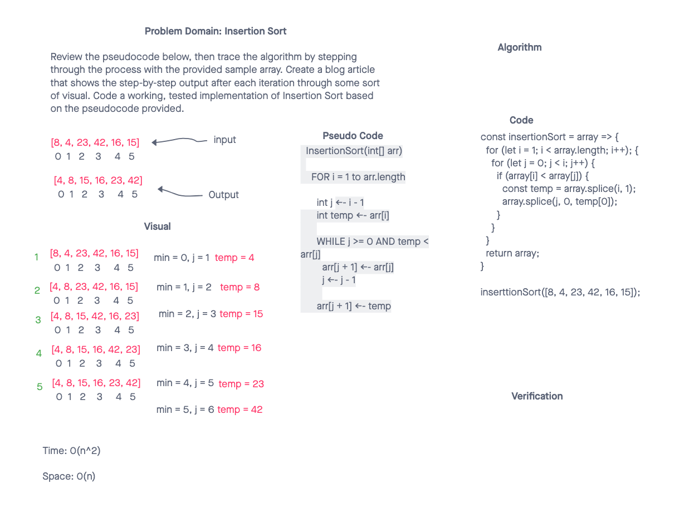

# Insertion Sort

## Challenge Description

- Review the pseudocode below, then trace the algorithm by stepping through the process with the provided sample array. Document your explanation by creating a blog article that shows the step-by-step output after each iteration through some sort of visual.

## Approach & Efficiency

- Insertion Sort works best for data that is already mostely sorted.
- the basic idea is selecting a single element at a time and then search for the correct places to insert it
- because of this the array has "two" parts the sorted part and the in-line to be sorted part
- this does not mean that there is two seperate arrays it is still one array.
- "i" tacks the outer loop and the current element in the sorted array. if nothing to sort
- "j" starts a i-1 and iterates from right to left untill it finds and places the correct element, while on the way each element is moved over by one to make room for the new sorted element

## Solution

## Collaborators Clement Buchanan

## Collaborators Solution

## refrences

- https://stackabuse.com/insertion-sort-in-javascript/
