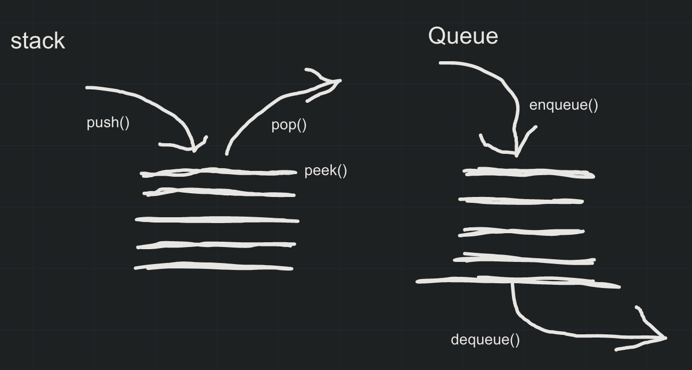

# Stacks and Queues

- Create a Node class that has properties for the value stored in the Node, and a pointer to the next node.
- Create a Stack class that has a top property. It creates an empty Stack when instantiated.
- Create a Queue class that has a front property. It creates an empty Queue when instantiated.

## Challenge

1. Can successfully push onto a stack
2. Can successfully push multiple values onto a stack
3. Can successfully pop off the stack
4. Can successfully empty a stack after multiple pops
5. Can successfully peek the next item on the stack
6. Can successfully instantiate an empty stack
7. Calling pop or peek on empty stack raises exception
8. Can successfully enqueue into a queue
9. Can successfully enqueue multiple values into a queue
10. Can successfully dequeue out of a queue the expected value
11. Can successfully peek into a queue, seeing the expected value
12. Can successfully empty a queue after multiple dequeues
13. Can successfully instantiate an empty queue
14. Calling dequeue or peek on empty queue raises exception

## Approach & Efficiency

Utilize the Single-responsibility principle: any methods you write should be clean, reusable, abstract component parts to the whole challenge. You will be given feedback and marked down if you attempt to define a large, complex algorithm in one function definition.

## white board

