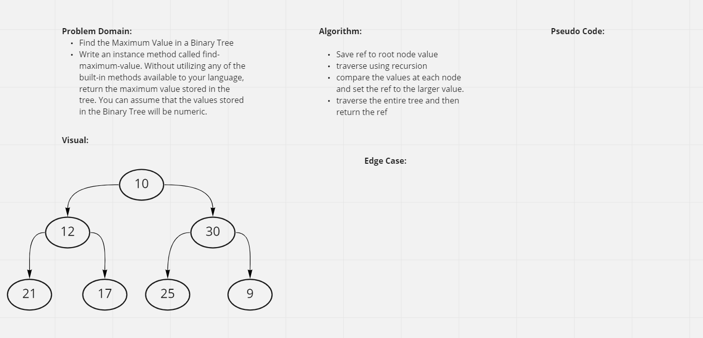
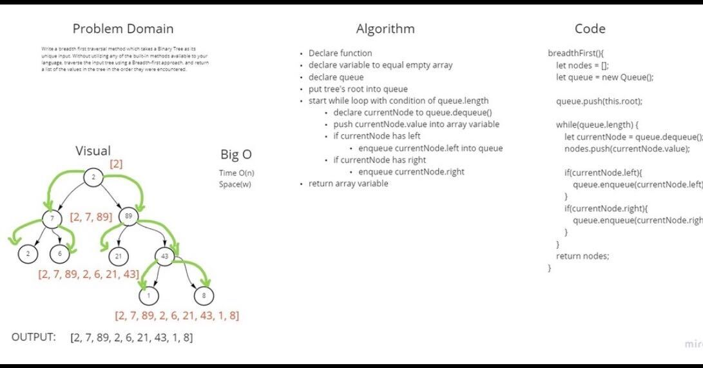

# Tree

## Challenge

- Create a Node class that has properties for the value stored in the node, the left child node, and the right child node.
- Create a BinaryTree class
- Define a method for each of the depth first traversals called preOrder, inOrder, and postOrder which returns an array of the values, ordered appropriately.

## Approach & Efficiency

- Utilize the Single-responsibility principle: any methods you write should be clean, reusable, abstract component parts to the whole challenge. You will be given feedback and marked down if you attempt to define a large, complex algorithm in one function definition.

- Write tests to prove the following functionality:

1. Can successfully instantiate an empty tree
2. Can successfully instantiate a tree with a single root node
3. Can successfully add a left child and right child to a single root node
4. Can successfully return a collection from a preorder traversal
5. Can successfully return a collection from an inorder traversal
6. Can successfully return a collection from a postorder traversal

## Solutions

[White board](https://docs.google.com/spreadsheets/d/1eZn3SfuDaDNs_GlhOQlwv66sE4boWq5Tz__1wBkvrqg/edit?usp=sharing)

# Find the Maximum Value in a Binary Tree

## Challenge

- Write an instance method called find-maximum-value. Without utilizing any of the built-in methods available to your language, return the maximum value stored in the tree. You can assume that the values stored in the Binary Tree will be numeric.

## Approach & Efficiency

- Utilize the Single-responsibility principle: any methods you write should be clean, reusable, abstract component parts to the whole challenge. You will be given feedback and marked down if you attempt to define a large, complex algorithm in one function definition.

## Solutions

# Breadth-first traversal

## challenge

- Write a breadth first traversal method which takes a Binary Tree as its unique input. Without utilizing any of the built-in methods available to your language, traverse the input tree using a Breadth-first approach, and return a list of the values in the tree in the order they were encountered.

## Approach & Efficiency

- Utilize the Single-responsibility principle: any methods you write should be clean, reusable, abstract component parts to the whole challenge. You will be given feedback and marked down if you attempt to define a large, complex algorithm in one function definition.

## Solutions

# "FizzBuzz"

## Challenge

- Write a function called FizzBuzzTree which takes a k-ary tree as an argument.
  Without utilizing any of the built-in methods available to your language, determine whether or not the value of each node is divisible by 3, 5 or both. Create a new tree with the same structure as the original, but the values modified as follows:
- If the value is divisible by 3, replace the value with “Fizz”
- If the value is divisible by 5, replace the value with “Buzz”
- If the value is divisible by 3 and 5, replace the value with “FizzBuzz”
- If the value is not divisible by 3 or 5, simply turn the number into a String.
- Return a new tree.

## Approach & Efficiency

- Conduct “FizzBuzz” on a k-ary tree while traversing through it to create a new tree.

Set the values of each of the new nodes depending on the corresponding node value in the source tree.

## Solutions

[whiteboard](https://docs.google.com/spreadsheets/d/1aMNXYED-Lo8wBP_O3qaNhKKi9KpB6enF15NqhJPiJS4/edit?usp=sharing)

