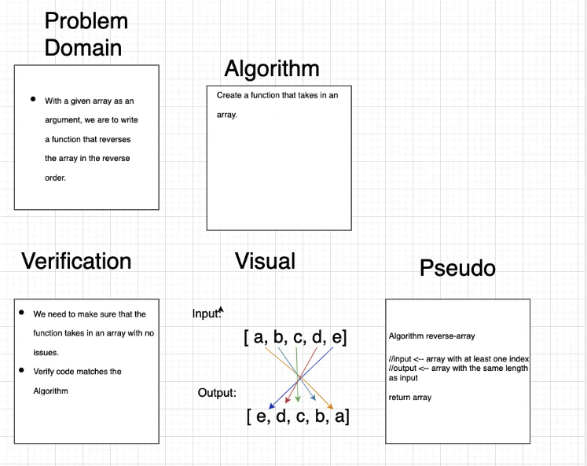

# array_reverse

# Reverse an Array
creating a function that takes in a string of numbers and returns then in reverse order

## Challenge
to change the output of a string to reverse the order in the event you need to see a count down or wanted things said from last to first, display least liked iteams to most like.

## Approach & Efficiency
the approach i took to this was a straight forword one take this and reverse it and print this

## Solution
