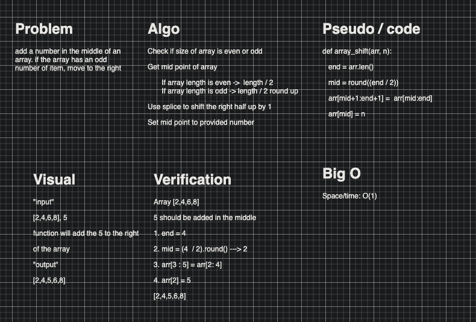

# array_shift

# Add something from outside a array to inside
creating a function that takes in a string of numbers and returns then in reverse order

## Challenge
to object and insert it into a array at a index

## Approach & Efficiency
im thinking copy original array and insert at index and output new array

## Solution
